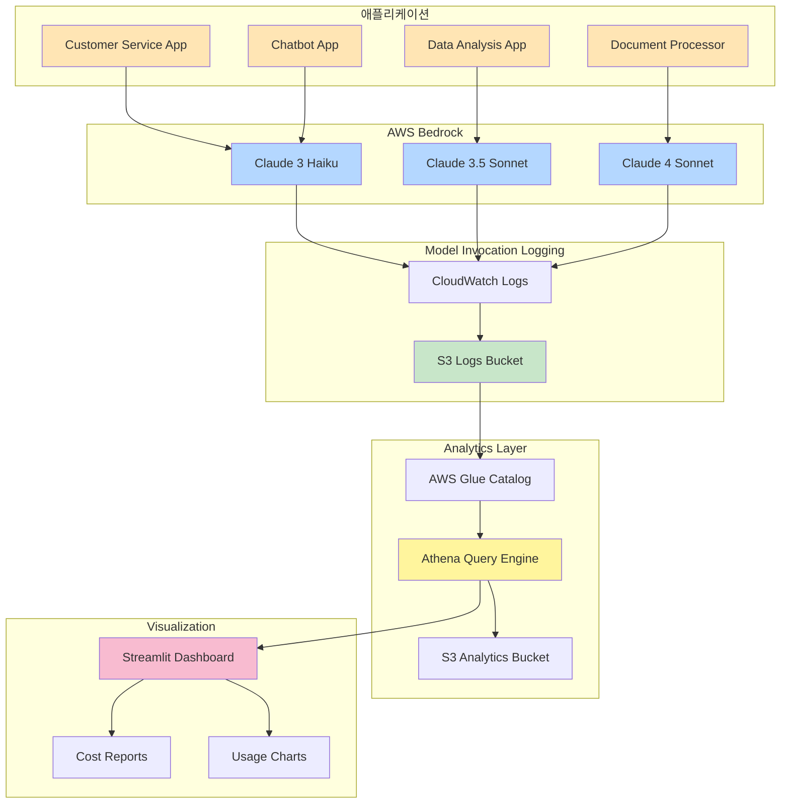

# AWS Bedrock Usage Analytics System

## 목차
- [애플리케이션 개요](#애플리케이션-개요)
- [핵심 기능](#핵심-기능)
- [시스템 아키텍처](#시스템-아키텍처)
- [환경 요구사항](#환경-요구사항)
- [설치 방법](#설치-방법)
- [사용 방법](#사용-방법)
- [소스코드 상세 설명](#소스코드-상세-설명)
- [시스템 플로우](#시스템-플로우)
- [데모](#데모)
- [문제 해결](#문제-해결)

---

## 애플리케이션 개요

### 목적
AWS Bedrock 모델 사용량을 **다중 리전**에서 추적하고 **애플리케이션별/사용자별** 비용을 분석하는 통합 분석 시스템입니다. AWS Model Invocation Logging과 Amazon Athena를 활용하여 **코드 수정 없이** 100% 정확한 사용량 추적이 가능합니다.

### 주요 용도
- **비용 모니터링**: 사용자/애플리케이션별 실시간 비용 분석
- **사용 패턴 분석**: 시간대별/일별 사용 패턴 파악
- **리전별 분석**: 다중 리전(US, Asia, Europe)에서 사용량 통합 관리
- **모델 최적화**: 모델별 사용 통계를 통한 비용 최적화

### 지원 리전
- **us-east-1**: US East (N. Virginia)
- **us-west-2**: US West (Oregon)
- **eu-central-1**: Europe (Frankfurt)
- **ap-northeast-1**: Asia Pacific (Tokyo)
- **ap-northeast-2**: Asia Pacific (Seoul)
- **ap-southeast-1**: Asia Pacific (Singapore)

### 지원 모델
- **Claude 3**: Haiku, Sonnet, Opus
- **Claude 3.5**: Haiku, Sonnet
- **Claude 3.7**: Sonnet
- **Claude 4**: Sonnet 4, Sonnet 4.5, Opus 4, Opus 4.1

---

## 핵심 기능

### 자동 로깅 및 추적
- AWS Model Invocation Logging을 통한 자동 로그 수집
- S3에 JSON 형식으로 저장된 로그 자동 파티셔닝
- 애플리케이션 코드 수정 완전히 불필요

### 다차원 분석
- **사용자별 분석**: IAM User/Role별 호출 수, 토큰 사용량, 비용
- **애플리케이션별 분석**: Role 기반 앱별 상세 비용 분석
- **모델별 분석**: Claude 모델별 평균/총 사용량 통계
- **시간 패턴 분석**: 시간별/일별 사용 패턴 시각화

### 실시간 대시보드
- Streamlit 기반 인터랙티브 웹 UI
- Plotly를 활용한 동적 차트 및 그래프
- 날짜 범위 선택 및 리전별 필터링
- CSV 데이터 다운로드 지원

### 비용 계산
- 모델별 정확한 토큰 단가 적용
- Input/Output 토큰 분리 계산
- USD 기준 실시간 비용 집계

---

## 시스템 아키텍처



---

## 환경 요구사항

### AWS 권한
다음 AWS 서비스에 대한 권한이 필요합니다:

```json
{
  "Version": "2012-10-17",
  "Statement": [
    {
      "Effect": "Allow",
      "Action": [
        "bedrock:InvokeModel",
        "bedrock:GetModelInvocationLoggingConfiguration",
        "bedrock:PutModelInvocationLoggingConfiguration",
        "bedrock:ListFoundationModels"
      ],
      "Resource": "*"
    },
    {
      "Effect": "Allow",
      "Action": [
        "s3:GetObject",
        "s3:ListBucket",
        "s3:PutObject",
        "s3:CreateBucket"
      ],
      "Resource": [
        "arn:aws:s3:::bedrock-analytics-*",
        "arn:aws:s3:::bedrock-analytics-*/*"
      ]
    },
    {
      "Effect": "Allow",
      "Action": [
        "athena:StartQueryExecution",
        "athena:GetQueryExecution",
        "athena:GetQueryResults"
      ],
      "Resource": "*"
    },
    {
      "Effect": "Allow",
      "Action": [
        "glue:CreateDatabase",
        "glue:CreateTable",
        "glue:GetDatabase",
        "glue:GetTable"
      ],
      "Resource": "*"
    }
  ]
}
```

### Python 환경
- **Python**: 3.8 이상
- **AWS CLI**: 2.0 이상 (선택사항)

### Python 패키지
```
boto3>=1.34.0
streamlit>=1.31.0
pandas>=2.0.0
plotly>=5.18.0
```

---

## 설치 방법

### 1. 저장소 클론
```bash
git clone <repository-url>
cd bedrock_usage
```

### 2. 가상환경 생성 (권장)
```bash
python -m venv venv
source venv/bin/activate  # Linux/Mac
# 또는
venv\Scripts\activate     # Windows
```

### 3. 패키지 설치
```bash
pip install -r requirements.txt
```

### 4. AWS 자격증명 설정
```bash
aws configure
# 또는 환경변수 설정
export AWS_ACCESS_KEY_ID=your_key
export AWS_SECRET_ACCESS_KEY=your_secret
export AWS_DEFAULT_REGION=us-east-1
```

---

## 사용 방법

### 전체 설정 플로우

#### Step 1: Athena 분석 환경 구축
```bash
python setup_athena_bucket.py
```
이 스크립트는 다음을 자동으로 수행합니다:
- 리전별 S3 Analytics 버킷 생성
- Glue 데이터베이스 및 테이블 생성
- 오늘 날짜 파티션 자동 추가
- 데이터 연결 테스트

#### Step 2: Bedrock 로깅 설정
```bash
python check_bedrock_logging.py
```
현재 Model Invocation Logging 설정 상태를 확인합니다.

```bash
python setup_bedrock_logging.py
```
Bedrock Invocation Logging을 설정합니다.

#### Step 3: IAM Role 권한 검증
```bash
python verify_bedrock_permissions.py
```
모든 리전에서 IAM Role의 Bedrock 접근 권한을 검증합니다.

#### Step 4: 테스트 데이터 생성
```bash
python generate_test_data.py
```
다양한 애플리케이션과 리전에서 샘플 Bedrock API 호출을 생성합니다.

#### Step 5: Streamlit 대시보드 실행
```bash
streamlit run bedrock_tracker.py
```
웹 브라우저가 자동으로 열리며 대시보드에 접속됩니다.

### 대시보드 사용법

1. **리전 선택**
   - 사이드바에서 분석할 AWS 리전 선택

2. **날짜 범위 설정**
   - 시작 날짜와 종료 날짜 선택

3. **데이터 분석 실행**
   - "🔍 데이터 분석" 버튼 클릭

4. **결과 확인**
   - 전체 요약: 총 API 호출, 토큰, 비용
   - 사용자별 분석: 상위 사용자 및 비용
   - 애플리케이션별 상세 분석: Role 기반 앱별 통계
   - 모델별 사용 통계: 모델 호출 비율
   - 시간 패턴 분석: 일별/시간별 차트

---

## 소스코드 상세 설명

### 1. setup_athena_bucket.py

**목적**: 다중 리전 Athena 분석 환경을 자동으로 구축하는 통합 설정 스크립트

**주요 함수**:

#### `get_account_id()`
```python
def get_account_id():
    return boto3.client('sts').get_caller_identity()['Account']
```
- AWS STS를 통해 현재 계정 ID 조회
- 리전별 버킷명 생성에 사용

#### `create_bucket_if_not_exists(s3_client, bucket_name, region)`
```python
def create_bucket_if_not_exists(s3_client, bucket_name, region):
    try:
        if region == 'us-east-1':
            s3_client.create_bucket(Bucket=bucket_name)
        else:
            s3_client.create_bucket(
                Bucket=bucket_name,
                CreateBucketConfiguration={'LocationConstraint': region}
            )
```
- S3 버킷 생성 (이미 존재하면 스킵)
- us-east-1은 LocationConstraint 불필요
- 다른 리전은 명시적 LocationConstraint 필요

#### `create_glue_resource(glue_client, resource_type, name, config)`
```python
def create_glue_resource(glue_client, resource_type, name, config):
    try:
        if resource_type == 'database':
            glue_client.create_database(DatabaseInput=config)
        else:
            glue_client.create_table(**config)
```
- Glue 데이터베이스 및 테이블 생성
- 파티션 키: year, month, day

#### `setup_region(region, account_id)`
리전별 전체 설정을 수행하는 핵심 함수:
```python
def setup_region(region, account_id):
    # 1. Analytics 버킷 생성
    analytics_bucket = f"bedrock-analytics-{account_id}-{region}"
    create_bucket_if_not_exists(s3, analytics_bucket, region)

    # 2. Glue 데이터베이스 생성
    create_glue_resource(glue, 'database', 'bedrock_analytics', {...})

    # 3. Bedrock 로깅 설정 확인
    config = bedrock.get_model_invocation_logging_configuration()

    # 4. Glue 테이블 생성 (파티션 포함)
    create_glue_resource(glue, 'table', 'bedrock_invocation_logs', {...})

    # 5. 오늘 날짜 파티션 추가
    partition_query = f"""
    ALTER TABLE bedrock_analytics.bedrock_invocation_logs
    ADD IF NOT EXISTS PARTITION (year='{year}', month='{month}', day='{day}')
    """

    # 6. 데이터 존재 테스트
    test_query = "SELECT COUNT(*) FROM bedrock_invocation_logs..."
```

**실행 플로우**:
1. 6개 리전 순회
2. 각 리전에 Analytics 버킷 생성
3. Glue Catalog 구성
4. Athena 쿼리 테스트

---

### 2. check_bedrock_logging.py

**목적**: 다중 리전 Bedrock Model Invocation Logging 설정 상태 확인

**주요 함수**:

#### `check_logging_for_region(region)`
```python
def check_logging_for_region(region):
    bedrock = boto3.client('bedrock', region_name=region)
    config = bedrock.get_model_invocation_logging_configuration()

    s3_config = config.get('loggingConfig', {}).get('s3Config', {})

    if s3_config:
        bucket_name = s3_config.get('bucketName', 'N/A')
        key_prefix = s3_config.get('keyPrefix', 'N/A')

        # 버킷 리전 확인
        s3 = boto3.client('s3')
        location = s3.get_bucket_location(Bucket=bucket_name)
        bucket_region = location['LocationConstraint'] or 'us-east-1'

        return {
            'enabled': True,
            'bucket': bucket_name,
            'prefix': key_prefix,
            'bucket_region': bucket_region
        }
```
- 특정 리전의 Bedrock 로깅 설정 조회
- S3 버킷, 키 프리픽스, 버킷 리전 정보 반환
- 설정되지 않은 경우 enabled: False 반환

#### `main()`
```python
def main():
    regions = ['us-east-1', 'us-west-2', 'ap-northeast-1',
               'ap-northeast-2', 'ap-southeast-1']

    for region in regions:
        results[region] = check_logging_for_region(region)
```
- 5개 주요 리전의 로깅 설정 확인
- 각 리전별 설정 상태 요약 출력

**출력 예시**:
```
🔍 Checking Multi-Region Bedrock Model Invocation Logging Configuration

Checking us-east-1...
Checking us-west-2...
Checking ap-northeast-1...

📋 Summary
us-east-1:
  Status: ✅ Enabled
  S3 Bucket: bedrock-logs-181136804328-us-east-1
  Key Prefix: bedrock-logs/
  Bucket Region: us-east-1

us-west-2:
  Status: ✅ Enabled
  S3 Bucket: bedrock-logs-181136804328-us-west-2
  Key Prefix: bedrock-logs/
  Bucket Region: us-west-2

ap-northeast-2:
  Status: ❌ Not Configured
  S3 Bucket: Not configured
  Key Prefix: N/A
  Bucket Region: N/A
```

---

### 3. setup_bedrock_logging.py

**목적**: 다중 리전에 Model Invocation Logging 자동 설정

**주요 함수**:

#### `setup_logging_for_region(region, bucket_name)`
```python
def setup_logging_for_region(region, bucket_name):
    bedrock = boto3.client('bedrock', region_name=region)

    # 현재 설정 확인
    current_config = bedrock.get_model_invocation_logging_configuration()

    # 로깅 설정
    response = bedrock.put_model_invocation_logging_configuration(
        loggingConfig={
            's3Config': {
                'bucketName': bucket_name,
                'keyPrefix': f'bedrock-logs/'
            }
        }
    )

    print(f"  ✅ Logging enabled: s3://{bucket_name}/bedrock-logs/")
    return True
```
- 특정 리전의 Bedrock 클라이언트 생성
- 현재 로깅 설정 확인
- S3 기반 Model Invocation Logging 활성화
- 로그는 `s3://{bucket_name}/bedrock-logs/` 경로에 저장

#### `main()`
```python
def main():
    regions = ['us-east-1', 'us-west-2', 'ap-northeast-1',
               'ap-northeast-2', 'ap-southeast-1']
    account_id = '181136804328'

    for region in regions:
        bucket_name = f'bedrock-logs-{account_id}-{region}'
        results[region] = setup_logging_for_region(region, bucket_name)
```
- 5개 주요 리전에 대해 순회
- 리전별 로그 버킷명 생성 (`bedrock-logs-{account_id}-{region}`)
- 각 리전에 로깅 설정 적용
- 결과 요약 출력

**실행 결과 예시**:
```
🔧 Setting up Multi-Region Model Invocation Logging
Setting up logging for us-east-1 -> bedrock-logs-181136804328-us-east-1...
  ✅ Logging enabled: s3://bedrock-logs-181136804328-us-east-1/bedrock-logs/

Setting up logging for us-west-2 -> bedrock-logs-181136804328-us-west-2...
  ✅ Logging enabled: s3://bedrock-logs-181136804328-us-west-2/bedrock-logs/

📋 Summary
us-east-1: ✅ Success -> s3://bedrock-logs-181136804328-us-east-1/bedrock-logs/
us-west-2: ✅ Success -> s3://bedrock-logs-181136804328-us-west-2/bedrock-logs/
```

---

### 4. verify_bedrock_permissions.py

**목적**: IAM Role의 다중 리전 Bedrock 권한 검증

**주요 함수**:

#### `test_bedrock_permissions()`
```python
def test_bedrock_permissions():
    regions = ['us-east-1', 'us-west-2', 'ap-northeast-1',
               'ap-northeast-2', 'ap-southeast-1']

    roles = [
        'CustomerServiceApp-BedrockRole',
        'DataAnalysisApp-BedrockRole',
        'ChatbotApp-BedrockRole',
        'DocumentProcessorApp-BedrockRole'
    ]

    for role_name in roles:
        # Role Assume
        assumed_role = sts.assume_role(
            RoleArn=f"arn:aws:iam::{account_id}:role/{role_name}",
            RoleSessionName=f"test-session-{role_name}"
        )

        # 각 리전에서 Bedrock 테스트
        for region in regions:
            bedrock = boto3.client(
                'bedrock',
                region_name=region,
                aws_access_key_id=credentials['AccessKeyId'],
                aws_secret_access_key=credentials['SecretAccessKey'],
                aws_session_token=credentials['SessionToken']
            )

            # Foundation models 조회
            response = bedrock.list_foundation_models()
            model_count = len(response.get('modelSummaries', []))
            print(f"✅ {region}: {model_count} models available")
```

**검증 항목**:
- IAM Role Assume 가능 여부
- 리전별 Bedrock API 접근 가능 여부
- 사용 가능한 모델 수 확인

**출력 예시**:
```
Testing role: CustomerServiceApp-BedrockRole
  ✅ Successfully assumed role
    ✅ us-east-1: 100 models available
    ✅ us-west-2: 109 models available
    ✅ ap-northeast-1: 33 models available
    ✅ ap-northeast-2: 18 models available
    ✅ ap-southeast-1: 16 models available
```

---

### 5. generate_test_data.py

**목적**: 다중 리전에서 여러 애플리케이션 시뮬레이션을 통한 테스트 데이터 생성

**테스트 시나리오 구조**:
```python
TEST_SCENARIOS = [
    {
        'type': 'role',  # 또는 'useragent'
        'name': 'CustomerServiceApp-BedrockRole',
        'role_arn': f'arn:aws:iam::{ACCOUNT_ID}:role/CustomerServiceApp-BedrockRole',
        'region': 'us-east-1',
        'model': 'us.anthropic.claude-3-haiku-20240307-v1:0',
        'calls': 3,
        'prompt': '고객 문의에 대한 답변을 작성해주세요'
    },
    # ... 총 13개 시나리오
]
```

**주요 함수**:

#### `call_bedrock_with_role(scenario)`
IAM Role을 Assume하여 Bedrock API 호출:
```python
def call_bedrock_with_role(scenario):
    # 1. STS로 Role Assume
    assumed_role = sts_client.assume_role(
        RoleArn=scenario['role_arn'],
        RoleSessionName=f"{scenario['name']}-test-session"
    )

    # 2. Assumed role credentials로 Bedrock 클라이언트 생성
    bedrock = boto3.client(
        'bedrock-runtime',
        region_name=scenario['region'],
        aws_access_key_id=assumed_role['Credentials']['AccessKeyId'],
        aws_secret_access_key=assumed_role['Credentials']['SecretAccessKey'],
        aws_session_token=assumed_role['Credentials']['SessionToken']
    )

    # 3. 지정된 횟수만큼 API 호출
    for i in range(scenario['calls']):
        response = bedrock.invoke_model(
            modelId=scenario['model'],
            body=json.dumps({
                "anthropic_version": "bedrock-2023-05-31",
                "max_tokens": 200,
                "messages": [{"role": "user", "content": scenario['prompt']}]
            })
        )
        time.sleep(0.5)  # Rate limit 방지
```

#### `call_bedrock_with_useragent(scenario)`
UserAgent를 설정하여 Bedrock API 호출:
```python
def call_bedrock_with_useragent(scenario):
    # UserAgent 설정
    config = Config(user_agent_extra=scenario['user_agent'])

    bedrock = boto3.client(
        'bedrock-runtime',
        region_name=scenario['region'],
        config=config
    )

    # API 호출
    for i in range(scenario['calls']):
        response = bedrock.invoke_model(...)
```

**시나리오 분포**:
- IAM Role 기반: 8개 (CustomerService, DataAnalysis, DocumentProcessor, etc.)
- UserAgent 기반: 5개 (MobileApp, WebPortal, BackendAPI, etc.)
- 리전별: us-east-1(4), us-west-2(2), ap-northeast-1(2), ap-northeast-2(2), ap-southeast-1(2)

**출력 예시**:
```
🔐 Testing: CustomerServiceApp-BedrockRole (IAM Role)
   Region: us-east-1
   Model: claude-3-haiku
   Calls: 3
   ✅ Call 1/3 succeeded
   ✅ Call 2/3 succeeded
   ✅ Call 3/3 succeeded
   📊 Result: 3/3 calls succeeded

📊 Results by Region:
   • us-east-1: 15 successful calls
   • us-west-2: 4 successful calls
   • ap-northeast-1: 5 successful calls
```

---

### 6. bedrock_tracker.py

**목적**: Athena 기반 실시간 사용량 분석 대시보드

**핵심 클래스**: `BedrockAthenaTracker`

#### 초기화 및 설정
```python
class BedrockAthenaTracker:
    def __init__(self, region=default_region):
        self.region = region
        self.athena = boto3.client("athena", region_name=region)
        sts_client = boto3.client("sts", region_name=region)
        self.account_id = sts_client.get_caller_identity()["Account"]
        self.results_bucket = f"bedrock-analytics-{self.account_id}-{self.region}"
```

#### `get_current_logging_config()`
Model Invocation Logging 설정 조회:
```python
def get_current_logging_config(self) -> Dict:
    bedrock = boto3.client("bedrock", region_name=self.region)
    response = bedrock.get_model_invocation_logging_configuration()

    if "loggingConfig" in response:
        config = response["loggingConfig"]
        if "s3Config" in config:
            return {
                "type": "s3",
                "bucket": config["s3Config"].get("bucketName", ""),
                "prefix": config["s3Config"].get("keyPrefix", ""),
                "status": "enabled"
            }
```

#### `execute_athena_query(query, database)`
Athena 쿼리 실행 및 결과 반환:
```python
def execute_athena_query(self, query: str, database: str = "bedrock_analytics") -> pd.DataFrame:
    # 1. 쿼리 실행
    response = self.athena.start_query_execution(
        QueryString=query,
        QueryExecutionContext={"Database": database},
        ResultConfiguration={
            "OutputLocation": f"s3://{self.results_bucket}/query-results/"
        }
    )

    query_id = response["QueryExecutionId"]

    # 2. 쿼리 완료 대기 (최대 60초)
    for i in range(60):
        result = self.athena.get_query_execution(QueryExecutionId=query_id)
        status = result["QueryExecution"]["Status"]["State"]

        if status == "SUCCEEDED":
            break
        elif status in ["FAILED", "CANCELLED"]:
            raise Exception(f"Query failed: {error}")

        time.sleep(1)

    # 3. 결과 조회 및 DataFrame 변환
    result_response = self.athena.get_query_results(QueryExecutionId=query_id)

    columns = [col["Label"] for col in result_response["ResultSet"]["ResultSetMetadata"]["ColumnInfo"]]
    rows = []

    for row in result_response["ResultSet"]["Rows"][1:]:  # 헤더 제외
        row_data = [field.get("VarCharValue", "") for field in row["Data"]]
        rows.append(row_data)

    return pd.DataFrame(rows, columns=columns)
```

#### 분석 쿼리 함수들

**사용자별 비용 분석**:
```python
def get_user_cost_analysis(self, start_date: datetime, end_date: datetime) -> pd.DataFrame:
    query = f"""
    SELECT
        CASE
            WHEN identity.arn LIKE '%assumed-role%' THEN
                regexp_extract(identity.arn, 'assumed-role/([^/]+)')
            WHEN identity.arn LIKE '%user%' THEN
                regexp_extract(identity.arn, 'user/([^/]+)')
            ELSE 'Unknown'
        END as user_or_app,
        COUNT(*) as call_count,
        SUM(CAST(input.inputTokenCount AS BIGINT)) as total_input_tokens,
        SUM(CAST(output.outputTokenCount AS BIGINT)) as total_output_tokens
    FROM bedrock_invocation_logs
    WHERE year >= '{start_date.year}'
        AND month >= '{start_date.month:02d}'
        AND day >= '{start_date.day:02d}'
    GROUP BY identity.arn
    ORDER BY call_count DESC
    """
    return self.execute_athena_query(query)
```

**모델별 사용 통계**:
```python
def get_model_usage_stats(self, start_date: datetime, end_date: datetime) -> pd.DataFrame:
    query = f"""
    SELECT
        regexp_extract(modelId, '([^/]+)$') as model_name,
        COUNT(*) as call_count,
        AVG(CAST(input.inputTokenCount AS DOUBLE)) as avg_input_tokens,
        AVG(CAST(output.outputTokenCount AS DOUBLE)) as avg_output_tokens,
        SUM(CAST(input.inputTokenCount AS BIGINT)) as total_input_tokens,
        SUM(CAST(output.outputTokenCount AS BIGINT)) as total_output_tokens
    FROM bedrock_invocation_logs
    WHERE year >= '{start_date.year}'
    GROUP BY modelId
    ORDER BY call_count DESC
    """
    return self.execute_athena_query(query)
```

**일별 사용 패턴**:
```python
def get_daily_usage_pattern(self, start_date: datetime, end_date: datetime) -> pd.DataFrame:
    query = f"""
    SELECT
        year, month, day,
        COUNT(*) as call_count,
        SUM(CAST(input.inputTokenCount AS BIGINT)) as total_input_tokens,
        SUM(CAST(output.outputTokenCount AS BIGINT)) as total_output_tokens
    FROM bedrock_invocation_logs
    WHERE year >= '{start_date.year}'
    GROUP BY year, month, day
    ORDER BY year, month, day
    """
    return self.execute_athena_query(query)
```

#### 비용 계산
```python
MODEL_PRICING = {
    "claude-3-haiku-20240307": {
        "input": 0.00025 / 1000,
        "output": 0.00125 / 1000,
    },
    "claude-3-5-sonnet-20241022": {
        "input": 0.003 / 1000,
        "output": 0.015 / 1000
    },
    # ... 전체 모델 가격표
}

def get_model_cost(model_id: str, input_tokens: int, output_tokens: int) -> float:
    # 모델 ID에서 모델명 추출
    model_name = model_id.split(".")[-1].split("-v")[0]

    # 가격 테이블에서 찾기
    for key, pricing in MODEL_PRICING.items():
        if key in model_name:
            cost = (input_tokens * pricing["input"]) + (output_tokens * pricing["output"])
            return cost

    # 기본 가격 (Claude 3 Haiku)
    default_cost = (input_tokens * 0.00025 / 1000) + (output_tokens * 0.00125 / 1000)
    return default_cost
```

#### Streamlit UI 구성
```python
def main():
    st.set_page_config(page_title="Bedrock Analytics Dashboard", page_icon="📊", layout="wide")
    st.title("📊 AWS Bedrock Analytics Dashboard")

    # 사이드바 설정
    selected_region = st.sidebar.selectbox("리전 선택", options=list(REGIONS.keys()))
    start_date = st.sidebar.date_input("시작 날짜", value=datetime.now() - timedelta(days=7))
    end_date = st.sidebar.date_input("종료 날짜", value=datetime.now())

    # 로깅 설정 확인
    tracker = BedrockAthenaTracker(region=selected_region)
    current_config = tracker.get_current_logging_config()

    # 분석 실행
    if st.sidebar.button("🔍 데이터 분석"):
        # 전체 요약
        summary = tracker.get_total_summary(start_date, end_date)
        col1, col2, col3, col4 = st.columns(4)
        col1.metric("총 API 호출", f"{summary['total_calls']:,}")
        col2.metric("총 Input 토큰", f"{summary['total_input_tokens']:,}")
        col3.metric("총 Output 토큰", f"{summary['total_output_tokens']:,}")
        col4.metric("총 비용", f"${summary['total_cost_usd']:.4f}")

        # 사용자별 분석
        user_df = tracker.get_user_cost_analysis(start_date, end_date)
        st.dataframe(user_df, use_container_width=True)

        # 차트 표시
        fig = px.bar(user_df.head(10), x="user_or_app", y="estimated_cost_usd")
        st.plotly_chart(fig, use_container_width=True)
```

---

## 시스템 플로우

### 데이터 수집 플로우

```
1. 애플리케이션이 Bedrock API 호출
   ↓
2. Model Invocation Logging이 자동으로 로그 생성
   ↓
3. S3 버킷에 JSON 로그 저장
   ├─ AWSLogs/{account-id}/BedrockModelInvocationLogs/
   └─ {region}/{year}/{month}/{day}/{timestamp}.json.gz
   ↓
4. Glue Catalog가 파티션 인식
   ↓
5. Athena에서 SQL 쿼리 가능
```

### 분석 실행 플로우

```
1. Streamlit UI에서 "데이터 분석" 버튼 클릭
   ↓
2. BedrockAthenaTracker 초기화
   ├─ 리전 설정
   ├─ Account ID 조회
   └─ Results 버킷 설정
   ↓
3. 로깅 설정 확인
   └─ get_current_logging_config()
   ↓
4. 여러 분석 쿼리 병렬 실행
   ├─ get_total_summary()
   ├─ get_user_cost_analysis()
   ├─ get_user_app_detail_analysis()
   ├─ get_model_usage_stats()
   ├─ get_daily_usage_pattern()
   └─ get_hourly_usage_pattern()
   ↓
5. Athena 쿼리 실행 및 대기
   ├─ start_query_execution()
   ├─ get_query_execution() (polling)
   └─ get_query_results()
   ↓
6. DataFrame으로 변환
   ↓
7. 비용 계산
   └─ calculate_cost_for_dataframe()
   ↓
8. Plotly 차트 생성 및 표시
   ├─ 사용자별 비용 Bar Chart
   ├─ 모델별 호출 Pie Chart
   ├─ 일별 사용 Line Chart
   └─ 시간별 사용 Line Chart
```

### 비용 계산 플로우

```
1. Athena 쿼리로 원시 데이터 조회
   ├─ model_name
   ├─ total_input_tokens
   └─ total_output_tokens
   ↓
2. calculate_cost_for_dataframe() 호출
   ↓
3. 각 행에 대해 반복
   ├─ 모델 ID 추출
   ├─ MODEL_PRICING 테이블 조회
   ├─ Input 비용 = input_tokens × input_price
   ├─ Output 비용 = output_tokens × output_price
   └─ 총 비용 = Input 비용 + Output 비용
   ↓
4. DataFrame에 'estimated_cost_usd' 컬럼 추가
   ↓
5. UI에 표시
```

---

## 데모

### 시스템 데모 영상

[](https://youtu.be/zWQ5dvICrAQ)

**데모 영상에서 확인할 수 있는 내용**:
- 초기 환경 설정 과정
- 테스트 데이터 생성
- Streamlit 대시보드 둘러보기
- 실시간 비용 분석
- 리전별/모델별 사용 패턴 확인

### 스크린샷

#### 전체 요약 대시보드


#### 사용자별 비용 분석


#### 모델별 사용 통계


---

## 문제 해결

### 로그가 생성되지 않는 경우

**증상**: S3 버킷에 로그 파일이 없음

**해결방법**:
1. Bedrock 로깅 설정 확인
   ```bash
   python check_bedrock_logging.py
   ```

2. S3 버킷 정책 확인
   ```json
   {
     "Effect": "Allow",
     "Principal": {"Service": "bedrock.amazonaws.com"},
     "Action": "s3:PutObject",
     "Resource": "arn:aws:s3:::your-bucket/*"
   }
   ```

3. Bedrock API 호출 리전과 로깅 설정 리전 일치 확인

### Athena 쿼리 실패

**증상**: "HIVE_PARTITION_SCHEMA_MISMATCH" 오류

**해결방법**:
1. 파티션 재생성
   ```sql
   ALTER TABLE bedrock_invocation_logs DROP PARTITION (year='2025', month='10', day='18');
   ALTER TABLE bedrock_invocation_logs ADD PARTITION (year='2025', month='10', day='18')
   LOCATION 's3://bucket/path/2025/10/18/';
   ```

2. Glue 테이블 스키마 확인
   ```bash
   aws glue get-table --database-name bedrock_analytics --name bedrock_invocation_logs
   ```

### 대시보드가 로딩되지 않는 경우

**증상**: Streamlit 앱이 무한 로딩

**해결방법**:
1. AWS 자격증명 확인
   ```bash
   aws sts get-caller-identity
   ```

2. 네트워크 연결 확인
   ```bash
   aws athena list-work-groups
   ```

3. 로그 확인
   ```bash
   cat log/bedrock_tracker_*.log
   ```

### 비용이 잘못 계산되는 경우

**증상**: 예상과 다른 비용 표시

**해결방법**:
1. MODEL_PRICING 테이블 확인 (bedrock_tracker.py:44-64)
2. 최신 Bedrock 가격표와 비교
3. 모델 ID 매칭 로직 확인
   ```python
   logger.debug(f"Model: {model_id}, Cost: ${cost:.6f}")
   ```

### IAM Role Assume 실패

**증상**: "AccessDenied" 또는 "AssumeRole failed"

**해결방법**:
1. Trust Policy 확인
   ```json
   {
     "Effect": "Allow",
     "Principal": {"AWS": "arn:aws:iam::ACCOUNT:user/YOUR_USER"},
     "Action": "sts:AssumeRole"
   }
   ```

2. IAM 권한 확인
   ```bash
   python verify_bedrock_permissions.py
   ```

---

## 추가 리소스

### 관련 문서
- [AWS Bedrock Model Invocation Logging](https://docs.aws.amazon.com/bedrock/latest/userguide/model-invocation-logging.html)
- [Amazon Athena Documentation](https://docs.aws.amazon.com/athena/)
- [AWS Glue Data Catalog](https://docs.aws.amazon.com/glue/latest/dg/catalog-and-crawler.html)

### 비용 정보
- [AWS Bedrock Pricing](https://aws.amazon.com/bedrock/pricing/)
- [Amazon S3 Pricing](https://aws.amazon.com/s3/pricing/)
- [Amazon Athena Pricing](https://aws.amazon.com/athena/pricing/)

### 지원
- GitHub Issues: [Create an issue](https://github.com/your-repo/issues)
- AWS Support: [Contact AWS Support](https://aws.amazon.com/support/)

---

## 라이선스

MIT License

Copyright (c) 2025

Permission is hereby granted, free of charge, to any person obtaining a copy of this software and associated documentation files (the "Software"), to deal in the Software without restriction, including without limitation the rights to use, copy, modify, merge, publish, distribute, sublicense, and/or sell copies of the Software, and to permit persons to whom the Software is furnished to do so, subject to the following conditions:

The above copyright notice and this permission notice shall be included in all copies or substantial portions of the Software.

THE SOFTWARE IS PROVIDED "AS IS", WITHOUT WARRANTY OF ANY KIND, EXPRESS OR IMPLIED, INCLUDING BUT NOT LIMITED TO THE WARRANTIES OF MERCHANTABILITY, FITNESS FOR A PARTICULAR PURPOSE AND NONINFRINGEMENT. IN NO EVENT SHALL THE AUTHORS OR COPYRIGHT HOLDERS BE LIABLE FOR ANY CLAIM, DAMAGES OR OTHER LIABILITY, WHETHER IN AN ACTION OF CONTRACT, TORT OR OTHERWISE, ARISING FROM, OUT OF OR IN CONNECTION WITH THE SOFTWARE OR THE USE OR OTHER DEALINGS IN THE SOFTWARE.

---

**프로젝트 작성자**: AWS Solutions Architect
**마지막 업데이트**: 2025-10-18
**버전**: 1.0.0
