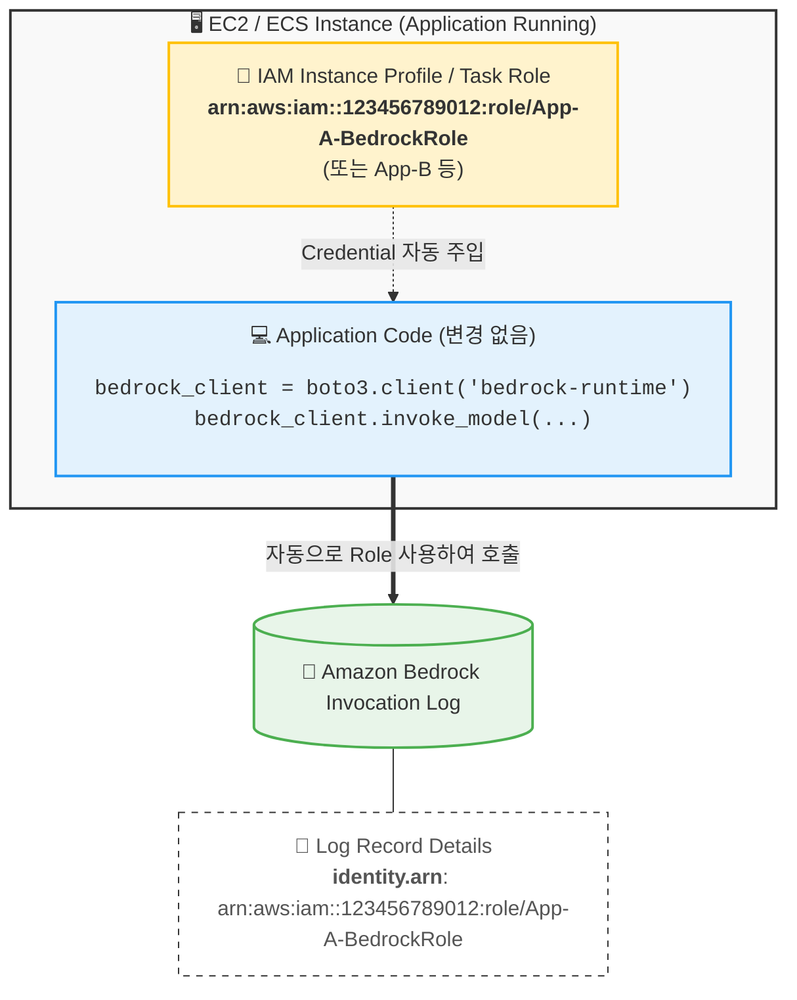

# Amazon Bedrock Identity & Logging Flow

이 다이어그램은 애플리케이션 코드 수정 없이 IAM Role(Instance Profile/Task Role)을 사용하여 Amazon Bedrock을 호출하고, 해당 신원이 로그에 어떻게 기록되는지를 보여줍니다.

### 핵심 포인트
1. **코드 수정 불필요**: `boto3`는 실행 환경(EC2/ECS)에 할당된 IAM Role을 자동으로 감지합니다.
2. **명확한 추적**: CloudTrail 및 Bedrock 로그에 실제 애플리케이션에 할당된 Role ARN이 `identity.arn`으로 기록됩니다.
3. **보안 모범 사례**: 소스 코드에 장기 자격 증명(Access Key)이나 Role ARN을 하드코딩하지 않습니다.
